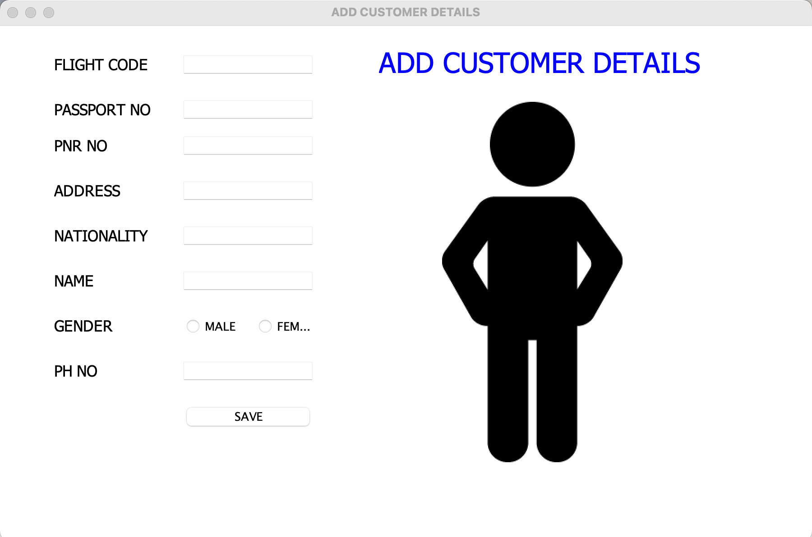
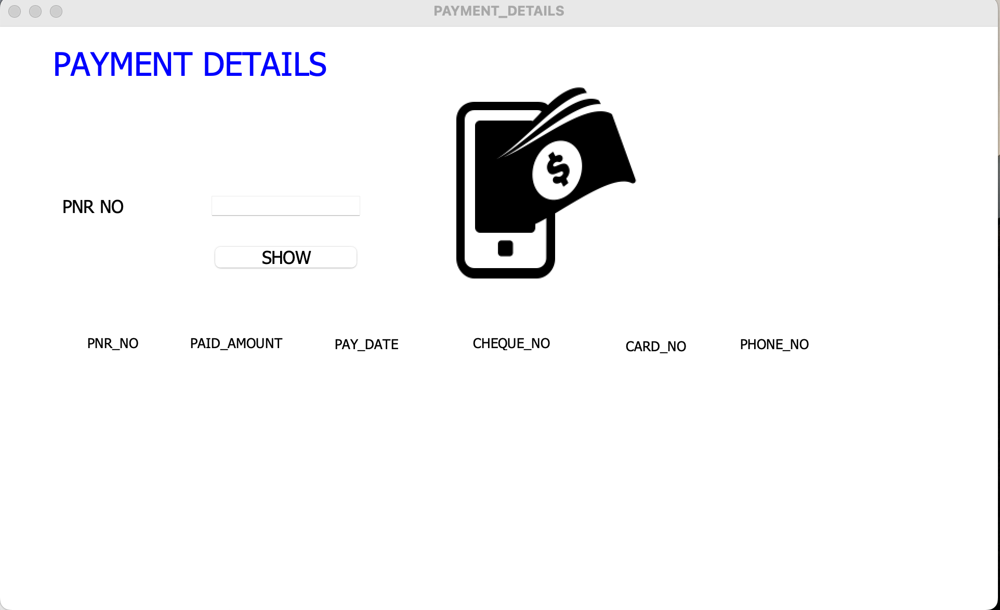

# Airline Management System

## 1. Project Description

The Airline Management System is a desktop application that enables users to manage passenger information, flight schedules, and booking details efficiently.

## 2. Tech Stack

- Java 11
- MySQL

## 3. Project Dependencies

- mysql-connector-java-8.0.27.jar
- rs2xml.jar

## 4. Installation

1. Clone the repository:
    ```
    https://github.com/gopuxyz/airline-management-system.git
    ```
2. Open the project folder in your IDE.
3. Explore the code and resources.

## 5. How To Use

1. Set up the database and tables using the SQL commands in `src/airline/mysql_commands.txt`.
2. Start your MySQL server.
3. Run `Login.java` to launch the application.
4. Log in with:
    - **User Name:** admin
    - **Password:** 12345

> **Note:** Ensure all dependencies are installed before running the project.

## 6. Demo

- **Login Page:**

  

- **Dashboard:**

  

- **Add Customer:**

  

- **Cancel Flight:**

  

- **Flight Information:**

  

- **Journey Details:**

  

- **Payment Page:**

  

## 7. Contributing

Contributions are welcome! For major changes, please open an issue first to discuss what you would like to change.

